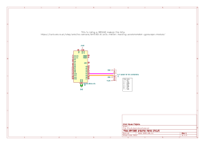

# Accelerometer and Gyroscope module data collection.

This testing script and circuit is used to test the functionlity of the BMI160 6 axis accelerometer and gyroscope. Specifically the I2C interface (there is an SPI interface I am not using). This script is based around using an arduino Nano running the script but, any board with I2C compatability should work. You will just have to change the ini file if you do.

For the BMI160 i purchased it from [Kunkune](https://kunkune.co.uk/shop/arduino-sensors/bmi160-6-axis-motion-tracking-accelerometer-gyroscope-module/) but there are other retailers selling the same module.

There is a schematic and test PCB made in KICAD in the folder `Circuit_Accel_Gyro` of how  everything should be connected together when using the I2C interface.

Once everything is connected make sure the [DFRobot BMI160](https://docs.arduino.cc/libraries/dfrobot_bmi160/) library is installed and avaliable to the project. Compile and upload the code. When you connect the board to the serial terminal you should see the acceleration and gyroscope values appear. These are the raw values from the sensor every secound just so that you are able to read the values a bit easier to read. To get more accurate values for processing you will need to remove the delay of 1000ms to increase your sampling rate.

I have not done any post processing on this script to get things like pitch and roll but i have come accross a few resources on the mathematics behind it if you are interested.

- [ESP32 with BMI160 Accelerometer & Gyroscope Sensor](https://how2electronics.com/esp32-with-bmi160-accelerometer-gyroscope-sensor/)
- [Measure Pitch, Roll, Yaw with MPU6050 + HMC5883L & ESP32](https://how2electronics.com/measure-pitch-roll-yaw-with-mpu6050-hmc5883l-esp32/)
- [Measuring Roll, Pitch, and Yaw Using 3-Axis Gyro on the MPU6050](https://toptechboy.com/measuring-roll-pitch-and-yaw-using-3-axis-gyro-on-the-mpu6050/)
- [Towards understanding IMU: Basics of Accelerometer and Gyroscope Sensors and How to Compute Pitch, Roll and Yaw Angles](https://atadiat.com/en/e-towards-understanding-imu-basics-of-accelerometer-and-gyroscope-sensors/)
- 

Big thanks to the DF robot team on their library and [their tutorial on their module](https://wiki.dfrobot.com/Gravity__BMI160_6-Axis_Inertial_Motion_Sensor_SKU__SEN0250) which was helpful for me getting my module to work.

Big thanks to [hanyazou](https://github.com/hanyazou) on github for his [BMI160 library README.md](https://github.com/hanyazou/BMI160-Arduino) helping me to wire my sensor together.