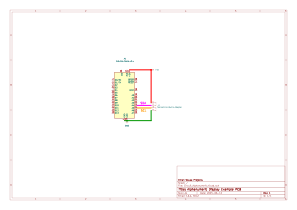

# Testing the Spark fun alpha Numeric Display

This testing sript and circuit is used to test the functionality of the SparkFun Qwiic Alphanumeric Display in it's ability to display letters and numbers (speed and units kph or mph). This is based around using an Arduino nano running the script but any board with I2C and the [SparkFun Qwiic Alphanumeric Display Arduino Library](https://docs.arduino.cc/libraries/sparkfun-qwiic-alphanumeric-display-arduino-library/) compatability should work. You will just have to change the ini file if you do.

For this display i purchased it from [Pihut](https://thepihut.com/products/sparkfun-qwiic-alphanumeric-display-purple). I specifically purchased the purple one due to my bikes purple theme. There are other colours. Other colours are avaliable like red, green, blue, white, etc. to fit your wants. You will need to get a qwiic breakout if you do not have a qwiic plug on your device like me. You could also solder header pins to the board following the [hookup guide from sparkfun](https://learn.sparkfun.com/tutorials/sparkfun-qwiic-alphanumeric-display-hookup-guide/all) but i would recommend getting the adaptor cable.

There is a schematic and test PCB made in KICAD in the folder `Circuit_Alphanumeric` of how everything should be connected together. You will require a breakout cable in my design.

Once everything is connected make sure the [SparkFun Qwiic Alphanumeric Display Arduino Library](https://docs.arduino.cc/libraries/sparkfun-qwiic-alphanumeric-display-arduino-library/) is installed and avaliable to the project. Compile and upload the code. You should see all the segments light up. Then you should see a small k is added to the last digit and the display counts up by 1 to 100. Finally, it repeats the counting to 100 but changes the last digit to a small m.