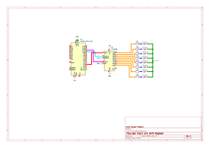

# Bar chart controlled by arduino with shift registers

This testing script and circuit is to the test the functionallity running a LED bar chart off an arduino using a 74HC595 shift register. This allows us to use more LEDs while not taking up too many of our arduino pins. This script is based around an arduino nano but any micro controller should work if you change the board in platform IO.

The 74HC595 shift register gives us the ability to drive 8 LEDs while only using 3 digital pins. This allows us to drive more LEDs than the arduino may normally be able to. I have two which i have purchased from [Kunkune](https://kunkune.co.uk/shop/compatible-with-arduino-compatible-starter-kits/advanced-arduino-r3-compatible-starter-kit/) as part of an arduino kit and [Pihut](https://thepihut.com/products/74hc595-shift-register-3-pack). There are methods to drive multiple of these shift registers in series in eachother. See [this arduino tutorial from Carlyn Maw & Tom Igoe](https://docs.arduino.cc/tutorials/communication/guide-to-shift-out/).

There is a scematic and test PCB made in KICAD in the folder `Circuit_Bar` of how everything should be connected together. You can change around the digital pins just remember to change it in the script as well.

Once everything is connected, compile and upload the code. You should slowly see all the lights light up in sequence before resetting. Some of the sequence is faster than other points due to how the incrementing loop works.

Some complexity of the code you may not understand imeditatly is the [byte](https://docs.arduino.cc/language-reference/en/variables/data-types/byte/) data type and the `<<` operation. The `<<` is a [bit shift left operation](https://docs.arduino.cc/language-reference/en/structure/bitwise-operators/bitshiftLeft/) to help me get the bits in the bytes setup correctly to light up the 0 to x lights. I am basically getting an integer from that operation subrating 1 and then converting back to a byte. [Conversion from Binary to decimal explaination can be found here](https://www.tutorialspoint.com/how-to-convert-binary-to-decimal).

Big thanks to [Elego](https://www.elegoo.com) for their [Arduino tutorials](https://www.elegoo.com/en-gb/pages/download) which got me started with this.

Big thanks to [Jason Clark](https://arduino.stackexchange.com/users/28183/jason-clark) on arduino Stack Exchange for his help on getting a [better way to calculate 2^X instead of using the arduino `pow()` function](https://arduino.stackexchange.com/questions/31191/is-there-a-non-float-alternative-to-pow).