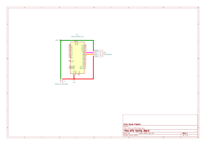

# Recieving GPS data test for CBR dash project

This testing script and circuit is to the test the functionallity of recieving GPS based data to eventually  be used in the dash project for ride logging where i could track a ride. Originally i thought i would use it for a speed value but due to reliabilty issues i have decieded against it. The Script is based around an arduino nano but any micro controller should work if you change the board in platform IO.

Most GPS modules you can buy online work pretty much the same and the most important pins are the power in (VCC/ VIN and GND) and the RX and TX pins. Most other pins are only there for advanced/ more complicated uses. Therefore, all my diagrams / discussions will only discuss those 4 pins. I have purchased a NEO-6M GPS module from [Kunkune](https://kunkune.co.uk/shop/communication-boards/gy-neo6mv2-gps-module-super-signal-with-antenna/). If you are to get a different GPS module, everything here should work. I would recommend getting a module with an external antenna to help with signal reliability. This module has a baud rate of 9600 so will use that for my serial interface. If you have a different baud rate of your module use that specified baud rate.

There is a scematic and test PCB made in KICAD in the folder `Circuit_GPS` of how everything should be connected together. Please note that the rx and tx lines connect to digital pins so that we can use the [software serial](https://docs.arduino.cc/learn/built-in-libraries/software-serial/) library as if we used the built in rx and tx lines we would loss USB serial communication to see things on the board. Please also note that the rx pin lines up with the software tx pin and vis versa for the tx pin. Reversing this will orientation will make the module not work.

Once everything is connected, make sure that the [TinyGPSPlus](https://docs.arduino.cc/libraries/tinygpsplus/) external libarary is installed for the project to parse the [GPS NEMA string](https://aprs.gids.nl/nmea/#vtg). compile and upload the code. If the USB serial interface you should see the current satalites attached, the longitude and latitiude and the speed of the module. If you are inside you may struggle to connect to any satalites thus being outside in an open area in prefered. Once you get a fix the values should all change to a different value than 0.

Big thanks to the developers behind the [software serial](https://docs.arduino.cc/learn/built-in-libraries/software-serial/) library for arduino and the [TinyGPSPlus](https://docs.arduino.cc/libraries/tinygpsplus/) library.

Big thanks to [random nerd tutorials](https://randomnerdtutorials.com/) for there article on the [NEO-6M GPS Module](https://randomnerdtutorials.com/guide-to-neo-6m-gps-module-with-arduino/) helping me with the coding of the module.

Big thanks to [last minute engineers](https://lastminuteengineers.com/) for there in depth article on the [NEO-6M GPS Module](https://lastminuteengineers.com/neo6m-gps-arduino-tutorial/) where i learned alot about the specifics of the module itself.

Lastly big thanks to the [Core electronics youtube creator](https://www.youtube.com/@Core-Electronics) and there video on [adding GPS to a raspberry pi pico](https://www.youtube.com/watch?v=CLsXnSOIYMg) where i learned alot about the inner workings of GPS.