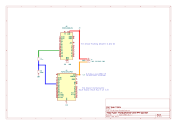

# Pulse Counter for Speed and RPM measurments

This testing script and circuit is used to test a pulse reading/ measuring script. This can then be used to translate the electrical pulses from the speed sensor and/or RPM pulses into speed or RPM data to be displayed on the dash. It is based on using an arduino nano running the RPM_TO_PWM script that is part of the `Testing_Scripts_And_Circuits` folder of this project and using a DOIT ESP32 devkit V1 to figure out the rpm/ count the pulses coming from the nano. Both scripts should work on any other microcontroller using the arduino framework.

It can be noted that we can find the rpm value by finding the time period of a pulse. We can then convert that to a frequency of pulses (... Hz). Once we have the frequency multiplying it by 60 would five the RPM value if you get one pulse per revolution. Slight math adjustment would be needed if you get something different to 1 pulse per rotation.
Speed is a tad more complicated but we can use the same theory of measuring the time of a pulse. If using something like a set of magnets, equally spaced on a wheel with a hall effect sensor picking them up. The time period would be the angle traveled between the two magnets. If we know the diameter or circumfrance, we could find the distance traveled along the circumfrance of the wheel. Therefore we would have distance and time and thus, speed = distance/ time.

It is important to note that the arduino works on 5V and the DOIT esp32 works on 3.3 volts thus a voltage divider was required for my use case. If alternative boards are used please make sure the voltage pulse measured is close to/ is the working voltage of micro controllers. Sending a 5V pulse to a 3.3V device may break the 3.3V device and sending a 3.3V pulse to a 5V device may just not recognise the signal as high.

There is a scematic and test PCB made in KICAD in the folder `Circuit_GPS` of how everything should be connected together. If you are not using the same boards as me, please adjust the voltage divider (resistors) to something more appropriate. Please also connect the grounds of the micro controllers together so that there is a common ground reference point/ plane.

Please note that the Kicad scematic uses a arduino nano ESP32 board instead of the DOit board. The connections are very similar just make sure the pin definitions are correct. I was unable to find a footprint for the DOIT dev kit. The important bit is the circuit divider taking the 5V pulse down to 3.3V if it is required. If it is not then you do not need to have it.

Once everything is connected, start both boards up having a serial monitor attached to each. On the nano you will have to type a RPM value to start the pulsing and on the measurment side you should see RPM and speed values. Verify they are as you expect by making some hand calculations based on your input parameters.

Big thanks to [TinkeringEngineer](https://www.instructables.com/member/TinkeringEngineer/) on instructables with his [Use Arduino to Display Engine RPM project](https://www.instructables.com/Use-Arduino-to-Display-Engine-RPM/) which helped me here improve on my initial idea for calculated speed and rpm.