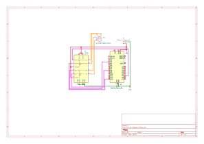

# Stepper Preset Move Test for CBR Dash Project

This testing script is used to test the wiring and usability of the X27.168 automotive gauge stepper motor with a L293D dual H bridge motor driver. The script attempts to move the stepper a set distance clockwise/ anticlockwise, then the same distance in the oposite rotation. Then half way in the original direction. Then make a half rotation in the oposite direction again.

The stepper motor is from [adafruit](https://www.adafruit.com/product/2424#technical-details) but i purchased the stepper from a reseller in the UK called [pihut](https://thepihut.com/products/automotive-gauge-stepper-motor). The L293D is fairly generic and can be found on most electronics sellers. I purchased this [driver from pihut](https://thepihut.com/products/dual-h-bridge-motor-driver-for-dc-or-steppers-600ma-l293d).

According to the [technical details](https://www.adafruit.com/product/2424#technical-details) provided by adafruit this stepper motor has a maximum step count of 600 steps which is approximatly 315 degrees so each step is approximatly half a degree. Therefore, to test the stepper system, the script will move 600 steps, then -600, then 300 then -300.
During this movement, you should see the needle rotate approximatly 315 degrees, then -315 degrees, 157 degrees then finally -157 degrees. This will help determin if the circuit is setup correctly and if the rpm set is at an appropriate value.

A wiring scematic and testing PCB has been included in the `Circuit_Stepper` folder for your reference. You can change which pins are used as mine was based on how I had everything layed out on a breadboard.

Once everything is connected, make sure the external stepper library has been added to the platformIO project, compile, upload and run the script. If everything is connected correctly, you should see the stepper move. You may have to adjust your stepper speed to make sure it does not skip. After testing i found 20 rpm to be the maximum thus will run mine at 19 rpm.

Thank you to [Joshua Hrisko](https://makersportal.com/blog?author=59b036fc6073554c1cfffef7) for his [write up](https://makersportal.com/blog/2018/1/29/driving-any-stepper-motor-for-less-than-1-with-the-l293) on how to do this and the developers behind the [arduino stepper library](https://docs.arduino.cc/libraries/stepper/#Usage/Examples).

Big thanks to [Wiktor Burdecki](https://github.com/wiciu15) and his github project named [motoHUDsch](https://github.com/wiciu15/motoHUDsch/tree/master) where he made a [KICAD footprint of the 27.168 stepper motor](https://github.com/wiciu15/motoHUDsch/blob/master/motoHUD.pretty/X27-168.kicad_mod) which i have taken as a base to build off and slightly modified it to fit the datasheet for the stepper motor i found [here](https://4tronix.co.uk/zeropoint/x27_spec.pdf) and the one [adafruit](https://cdn-shop.adafruit.com/product-files/2424/2424.pdf) provided.