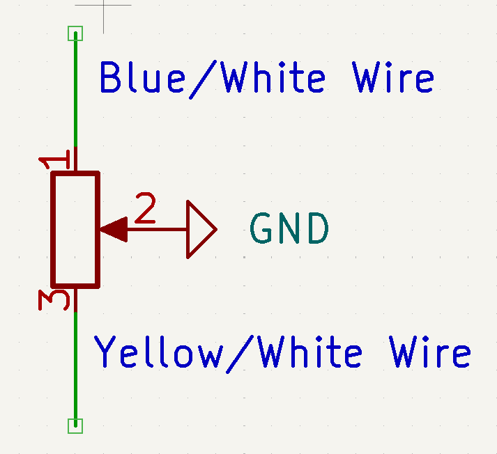
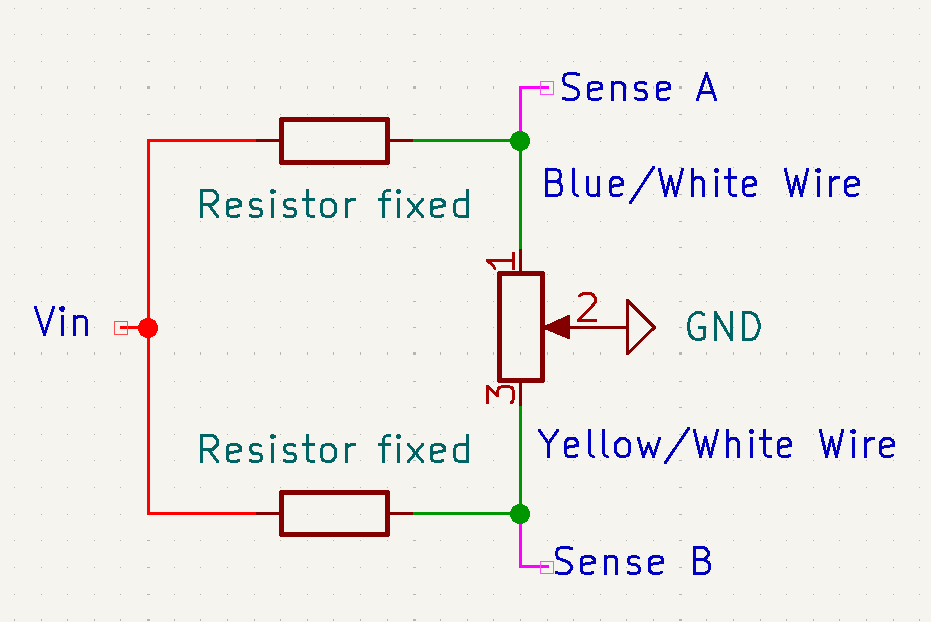
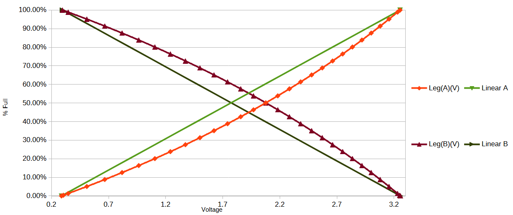
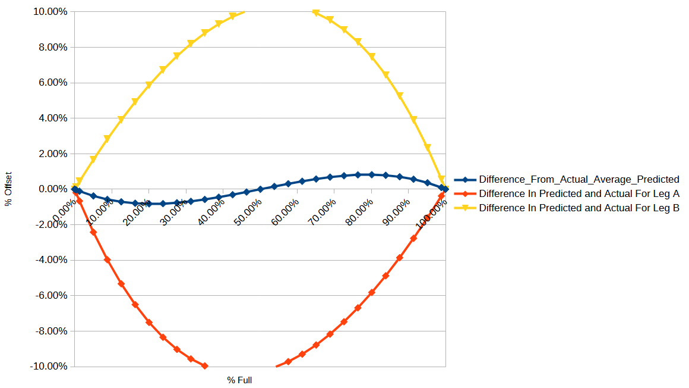

# Fuel Level Reference Calculations conclusion

To use the stock fuel level sensor we have to understand how the current sensor operates in the bike.

From a [Haynes repair manual for the CBR 125R 2004-2010](https://haynes.com/en-gb/honda-motorcycle/cbr125r/2004-2010) manual for the CBR 125R. it states the following with regards for the resistance between wires of the fuel level sensor that go from the sensor up to the stock cluster:

| Wire Colors               | Full Position | Empty Position |
| ------------------------- | ------------- | -------------- |
| Green - Blue/White        | 556 Ohms      | 33 Ohms        |
| Green - Yellow/White      | 33 Ohms       | 556 Ohms       |
| Blue/White - Yellow/White | 600 Ohms      | 600 Ohms       |

It must be noted that the Green wire is a ground wire on the bike. Therefore we can make the conclusion that the fuel sensor is a potentiometer where the ground is the whipper position. An image of the circuit can be seen bellow.

Now that we know how the sensor is wired, we can create a circuit of how our system needs to be wiring together to measure the resistance of the sensor and thus determine how full the tank is. This will involve a [voltage divider circuit](https://en.wikipedia.org/wiki/Voltage_divider) to get a voltage between a known resistance and a variable one (the variable one being the sensor in this case).

Now that we have developed the system wiring, we can develop equations to find the voltage at positions Sense A and Sense B. Please note that these positions will have identical reactions but in opposite directions. Thus we can find the fixed resistance in one leg and thus will know what is required for the other leg. Just note that resistance values correspond to opposite values of fullness.

$Vin{ {Rx} \over {Rt} } \le 3.3$ where $Rt = Rx + Rf$.

- $Vin$ is the driving voltage of the circuit. For my use case i will be using 9V as that is one of my standard voltages of my design.

- $Rx$ is the value of the potentiometer resistance. The values we are mostly interested in are the maximum and minimums which are 566 Ohms and 33 Ohms respectively. This is the driver for what the voltage will be at the sense side.

- $Rt$ is total resistance between the fixed resistor ($Rf$).

- The $3.3$ is the maximum voltage that my micro controller can take which is why it is on the right side of the inequality as for any $Rx$ value i need it to always be bellow $3.3 V$.

If we think about the [Equations behind a voltage divider](https://en.wikipedia.org/wiki/Voltage_divider) we will know that in our case the higher the $Rx$ value the higher the voltage will be. Therefore, we can find the minimum value of $Rf$ required to make sure the sense voltage never exceeds $3.3V$.

$9 {556 \over 556 + Rf} \le 3.3$

${556 \over 556 + Rf} \le {3.3 \over 9}$

$556 \le 0.36667(556 + Rf)$

${556 \over 0.36667} \le 556 + Rf$

$1543.5 - 566 \le Rf$

$977.5 \le Rf$

Therefore, $Rf$ must be greater than $977.5$ Ohms. If we use a standard resistor, the closest value higher than this is a 1 Kilo ohm resistor. This that is what will be used.

All further calculations are included in the file named `Level_VS_Resistance_Test_calcs.ods` which is a Libre Office Calc document.

With all this information, If we assume the relationship is linear between the resistance and fullness of the tank, we can predict how full the tank will be. It must be noted however that the voltage will not be linear. Therefore we will get some offset from the predicted value of fulness if we assume that the voltage is linear between fullness as well. This can be seen in the chart bellow:

To mitigate this we can use the average of the legs predicted values to get a value much closer to the actual value of the tank fullness. This can be seen in the chart bellow:

We are not fully at the actual value but we are much closer compared to the upwards of 10% off if we were to only look at one leg. As very a precise accuracy is not needed the 1ish % offset is fine.

We now know the requires in our schematic for our dash and it can be implemented.
