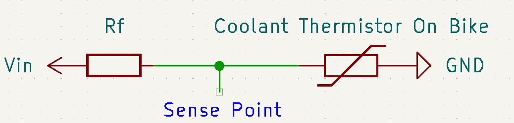

# Thermistor Design Calculations

This document details set properties of the stock thermistor of the CBR 125RW6 radiator and the design decisions made because of it. It is supported by charts mathematical equations.

All charts are made in the file: `Design_Charts.ods` it is a Libre Office Calcs document.

## The Active resistance Range of the sensor

From the [Haynes cbr125r manual](https://haynes.com/en-gb/honda-motorcycle/cbr125r/2004-2010) wiring diagram it is clear that the sensor is a thermistor that is wired to ground and the dash sensor. The coolant temperature gauge has 3 wires connected to it: one for Voltage in, One for ground and one wire which goes to the sensor which is also wired to ground. I could not find resistance values of the sensor which match up with the needle positions of the gauge from the manual. Therefore, testing was required to find the resistance values the sensor can achieve and what that would look like on the gauge.

This testing was conducted by powering the gauge with 12 volts through the power pins (Vin and ground) determined from the wiring diagram in the manual. Then connected the sense wire to one end of a resistor/ resistor chain (resistors in parallel) with the other end of the resistor / resistor chain to ground. This simulates the thermistor at a specific resistance which would normally correspond to a certain temperature. The needle position will be noted and the resistance adjusted until we found resistances that matched up with needle positions of interest. Those positions being:

- Just letting off cold side limit

- 25% mark

- 50% mark

- 75% mark

- Just before reaching hot side limit

This relationship was then put into a table and charted to analysis the relationship.

| Needle Position  | Resistance (Ohms) |
| ---------------- | ----------------- |
| 0% **(Note 1)**  | 1000              |
| 25%              | 727               |
| 50%              | 579               |
| 75%              | 470               |
| 100%**(Note 2)** | 377               |

**Note 1:** When the needle just starts to move off edge. Any value above this will not move needle.

**Note 2:** When needle just reaches top edge. Any value lower than this will stay at the top edge.

If we were to chart this data including the effect of higher and lower resistances at the limits we would get:

From the results and charts gathered from the test we have determined the active range of the needle gauge on the stock bike and thus the range of interest for the new dash project.

## Nano Sensor Circuit Design

To detect the resistance value we need to use a [voltage divider](https://en.wikipedia.org/wiki/Voltage_divider) circuit. For our use case, our voltage divider circuit will look like:

From this we can develop an equation to find the voltage at the sense point and as we know the voltage limit on the [Arduino Nano ESP32](https://docs.arduino.cc/hardware/nano-esp32/) is 3.3V set the voltage limit at the sense point.

$Vin { Rx \over Rx + Rf} \le 3.3V$

Where:

- $Rx$ is the resistance of the coolant thermistor on the bike

- $Rf$ is the fixed resistor we have to add

- $Vin$ is the source voltage into the line

If we think about what could happen in the circuit based on the data collected. It is possible in the most extreme cases for the sensor resistance to become practically 0 if the bike were to get too hot. Therefore, if we set $Rx$ to 0 Ohms and complete the calculation we find the $Vin$ must not exceed $3.3V$.

From this, we now know that $Vin$ must be $3.3V$ to get the largest sensing voltage range out of our micro controller.

It is also possible for the sensor to read infinite resistance if the bike were to get too cold. Therefore meaning that we can never reach a voltage sense of 0V as $Rx$ is the numerator of the fraction. We can however, find a $Rf$ value that will give us the most ideal voltage curve that is as linear as possible with a satisfactory voltage range.

To do this we can reconfigure our equation above to:

$3.3 {Rx \over Rx + Rf}=V_{sense}$

We can then use this equation to plot multiple lines of different $Rf$ values to find the most appropriate one.

If we first plot a chart of the voltage differences between the top and bottom values we get a chart like:

This cart shows us that in the best case scenario the voltage range is at best around 0.8V. This is very low but unfortunately we have a very large active range of the sensor so we have to use it. If we remove all the points with a Voltage delta of less than $0.5V$ we get:

We can plot a like onto this and see that we get a polynomial trend for the range of $Rf$ between approximately between 200 and 1100 Ohms.

We get a very good fit with a power of 5 polynomial (R value = 1). It also shows that the most ideal resistor is about 600 Ohms. As that is not a standard resistor I will choose either 510 or 680 Ohms. Either will be fine.

We may also want to have a look at the trend line between our points of interest of the reduced $Rf$ value range. We get a chart like the one bellow:

We can see from this that between the points of interest we have a very linear relationship with high R values. Therefore, a linear relationship can be established and used in code making things simpler.

Due to the 12 bit resolution of the [Arduino nano esp32](https://docs.arduino.cc/tutorials/nano-esp32/cheat-sheet/) meaning we get values between 0 and 4095 (0V for 0, 3.3V for 4095) we can find the maximum amount of steps in our sensor. With a 510 Ohm resistor we get approximately a delta V of 0.77 volts.

Voltage per step: ${3.3 \over 4095} \approx 0.000806$

Amount of steps in interest range = ${0.77 \over 0.000806} \approx 955$ steps.

This range is satisfactory for my use case.

 From all this, a 510 Ohm resistor for $Rf$ will be used giving use satisfactory resolution.
